# TackQuote for WooCommerce

> Part of the TackQuote integrations family. All platforms are listed on the TackQuote GitHub organization page: [github.com/tackquote](https://github.com/tackquote) (TackQuote integrations index).

Add a **Request a Quote** button to your WooCommerce store and sync orders with your [TackQuote](https://tackquote.com) B2B quoting account.

- 🧾 "Add to Quote" and "Request a Quote" buttons on product pages, plus a floating quote list with "Checkout as Quote"
- 🛒 **More places to start a quote** (each off by default): "Add to Quote" on product cards, "Request a quote for your cart" on the classic cart and the Cart block, and a quote page via `[tackquote_quote_page]` with quantities, target prices and a message
- 🎯 **Floating launcher settings** — position, offsets, label, icon only, count, size, pages, hide on mobile; defaults match the 1.8 launcher
- 🔒 **Quote only per product** (variations inherit, enforced in `woocommerce_is_purchasable` and the Store API) and a store-wide scope that keeps the cart for **approved wholesale accounts** only
- 💷 **B2B pricing** — signed-in trade customers priced from their TackQuote price book, buyer group and quantity breaks, with an optional volume-pricing table
- 📦 **Order limits** — minimum/maximum order quantities shown on the product page and enforced at the cart and checkout
- 🏷️ **Buyer group badge** — tells a customer which pricing group they are on, so a discounted price does not read as an error
- 👥 **Per buyer group** (each off by default) — hide product categories (loops, search, blocks, Store API, related/up-sells; direct URL 404; not purchasable; removed from carts), free or percentage-off shipping applied after the group restrictions, and an optional `tackquote_<code>` WordPress role (read only, never drives pricing)
- 🧭 **Tabbed settings page** — Overview dashboard plus Connection, Storefront, B2B pricing, Buyer groups, Forms and Order sync tabs; each tab saves only its own settings
- 🧾 **Net terms at checkout** (off by default) — payment method "Net terms (TackQuote)" (`tackquote_net_terms`, classic checkout and Checkout block) for buyers TackQuote has approved; the order goes on hold, never marked paid, and fails closed when TackQuote cannot confirm the buyer. Optional checkout PO number sent with the order
- 🔁 Optional one-way order sync to TackQuote (on creation and status change), queued through Action Scheduler so it never runs inside checkout
- 🔑 Simple setup: paste your TackQuote API key
- 🌐 Storefront text bundled in German, Spanish, French, Italian, Japanese, Dutch and Brazilian Portuguese (`languages/`, generated from the shared TackQuote catalogue; see [`languages/README.md`](languages/README.md))
- 🛡️ HPOS- and Cart/Checkout-blocks-compatible; nonce, capability and rate-limit protected; removes its own options, transients, user and product meta and queued jobs on uninstall

See the `== External services ==` and `== Privacy ==` sections of [`readme.txt`](readme.txt) for exactly which fields are sent to TackQuote, when, and what the plugin stores locally.
TackQuote's [Terms of Service](https://tackquote.com/terms) and
[Privacy Policy](https://tackquote.com/privacy) govern use of the service.

## Screenshots

The same images and captions as the wordpress.org listing (files in [`.wordpress-org/`](.wordpress-org/), captions from `== Screenshots ==` in [`readme.txt`](readme.txt)). Demo store content on Twenty Twenty-Five unless noted; features that need a TackQuote answer (prices, groups, limits, net terms, forms, quote checkout) were captured with demo server responses.

<table>
<tr><td width="50%"><a href=".wordpress-org/screenshot-1.png">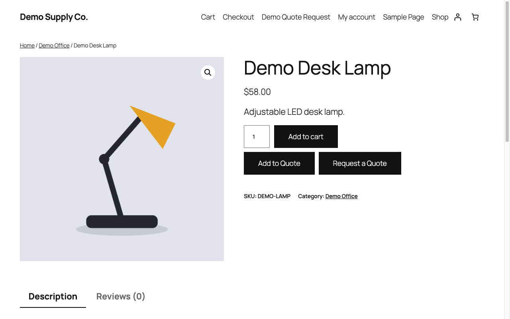</a><br><sub>1. Add to Quote and Request a Quote sit beside Add to cart on the product page (Twenty Twenty-Five).</sub></td><td width="50%"><a href=".wordpress-org/screenshot-2.png">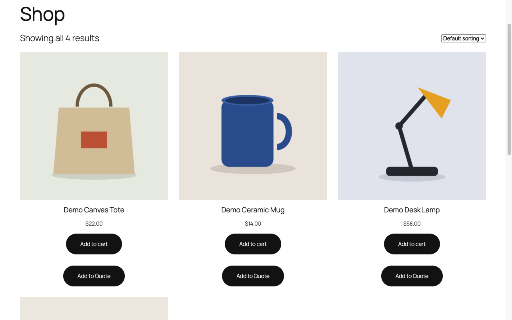</a><br><sub>2. Product cards in the shop grid can carry an Add to Quote button.</sub></td></tr>
<tr><td width="50%"><a href=".wordpress-org/screenshot-3.png">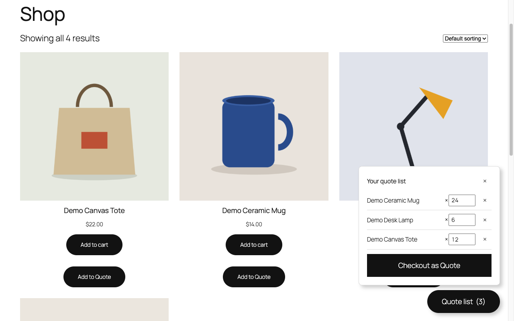</a><br><sub>3. The quote drawer lists the chosen products and quantities, with Checkout as Quote.</sub></td><td width="50%"><a href=".wordpress-org/screenshot-4.png">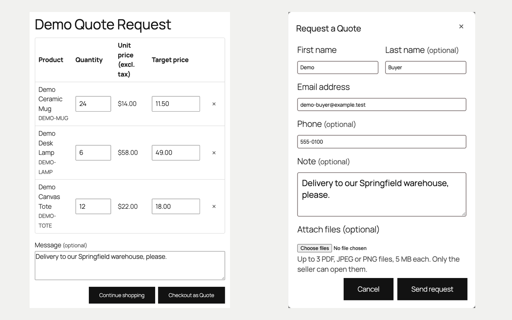</a><br><sub>4. The quote page from the [tackquote_quote_page] shortcode takes target prices and a message, and the request form can carry attachments.</sub></td></tr>
<tr><td width="50%"><a href=".wordpress-org/screenshot-5.png">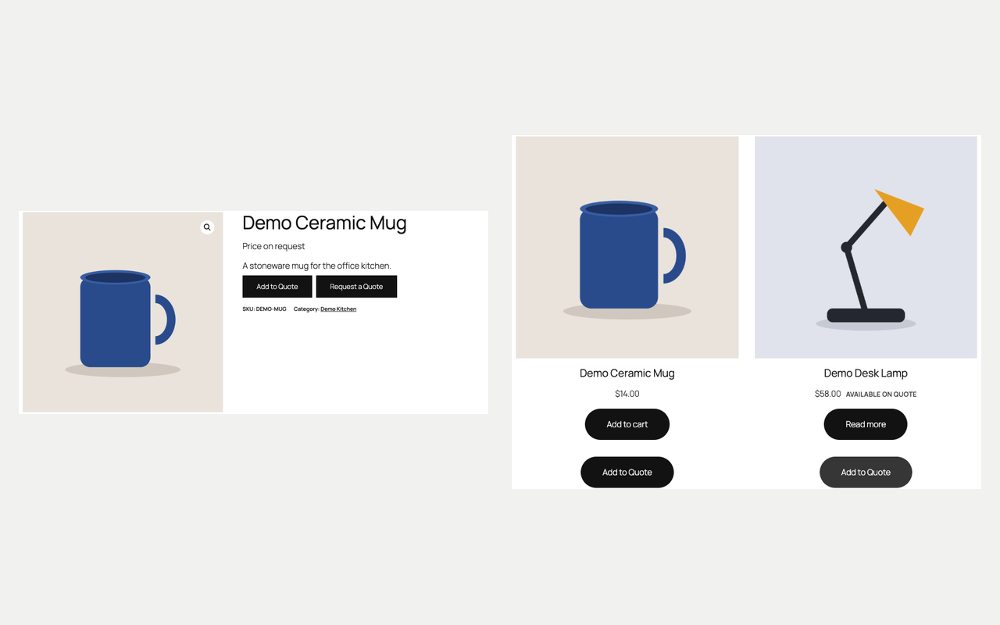</a><br><sub>5. Quote-only mode shows "Price on request" in place of prices, and single products can be marked "Available on quote".</sub></td><td width="50%"><a href=".wordpress-org/screenshot-6.png">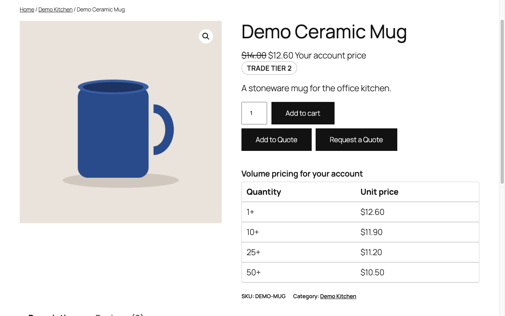</a><br><sub>6. A signed-in buyer sees their account price, their buyer group badge and a volume pricing table.</sub></td></tr>
<tr><td width="50%"><a href=".wordpress-org/screenshot-7.png">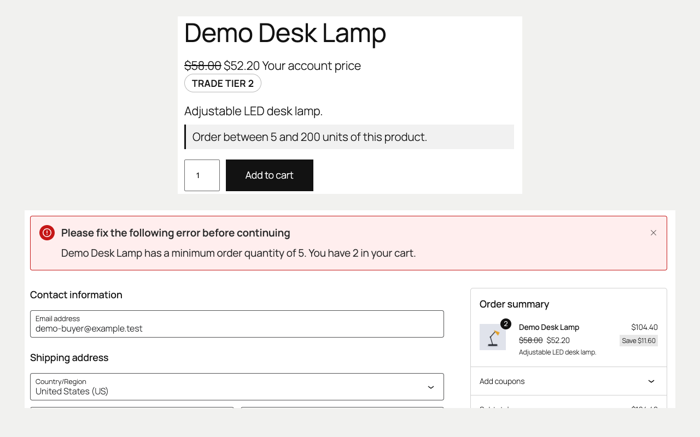</a><br><sub>7. Order limits show on the product page and are enforced in the cart and the Checkout block.</sub></td><td width="50%"><a href=".wordpress-org/screenshot-8.png">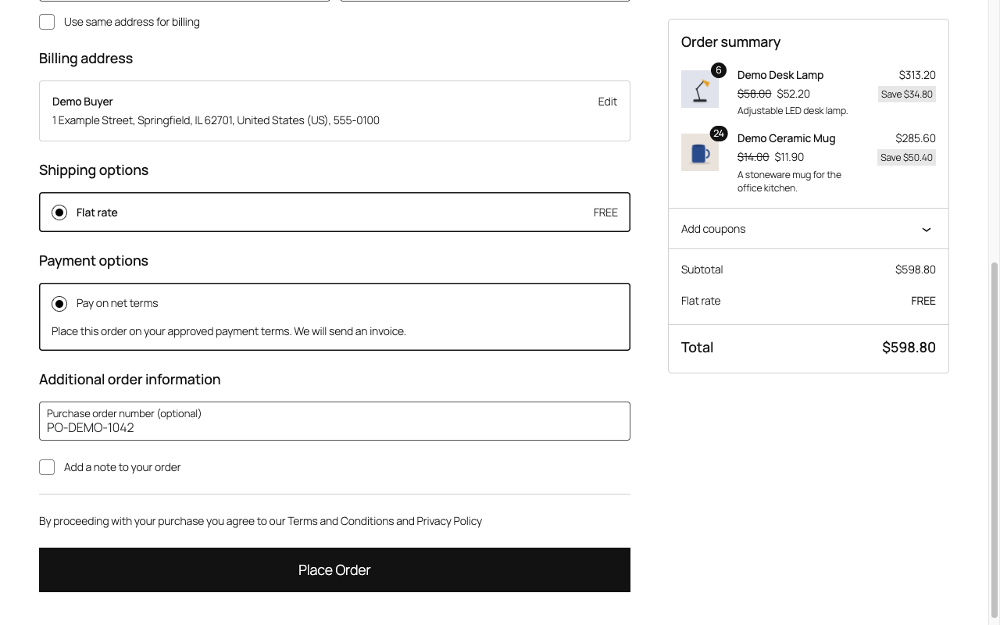</a><br><sub>8. Buyers TackQuote has approved can pay on net terms at checkout and add a purchase order number.</sub></td></tr>
<tr><td width="50%"><a href=".wordpress-org/screenshot-9.png">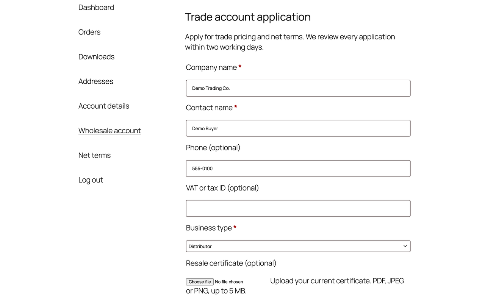</a><br><sub>9. The wholesale application form in My Account is the form you design in TackQuote, file fields included.</sub></td><td width="50%"><a href=".wordpress-org/screenshot-10.png">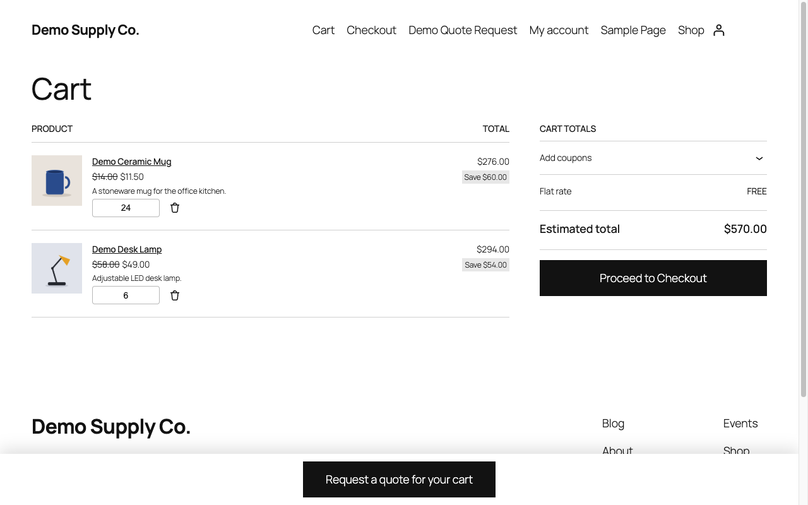</a><br><sub>10. A checkout link from an accepted quote fills the cart at the quoted prices with the quantities locked.</sub></td></tr>
<tr><td width="50%"><a href=".wordpress-org/screenshot-11.png">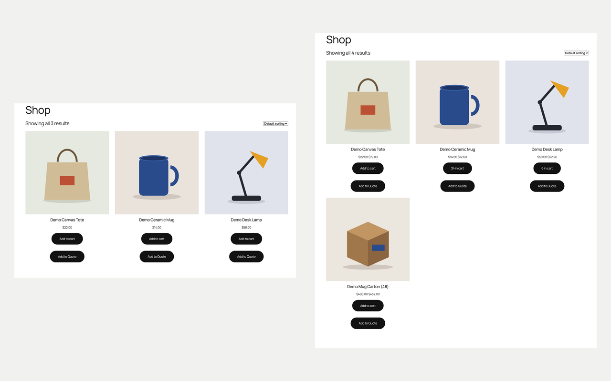</a><br><sub>11. Categories hidden per buyer group: a guest (left) does not see the trade range that a Tier 2 buyer (right) sees.</sub></td><td width="50%"><a href=".wordpress-org/screenshot-12.png">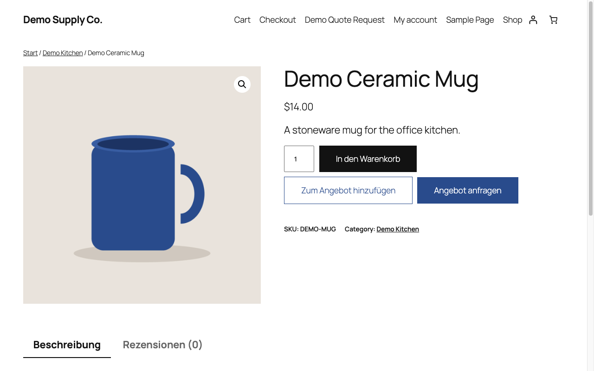</a><br><sub>12. Storefront buttons in German from the bundled translations.</sub></td></tr>
<tr><td width="50%"><a href=".wordpress-org/screenshot-13.png">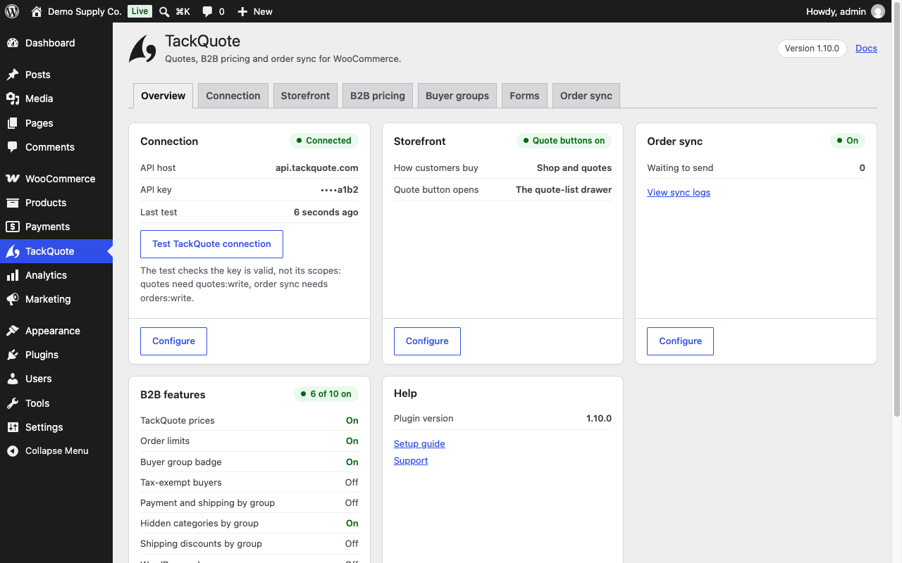</a><br><sub>13. The Overview tab shows the connection, the storefront mode, order sync and every B2B switch.</sub></td><td width="50%"><a href=".wordpress-org/screenshot-14.png">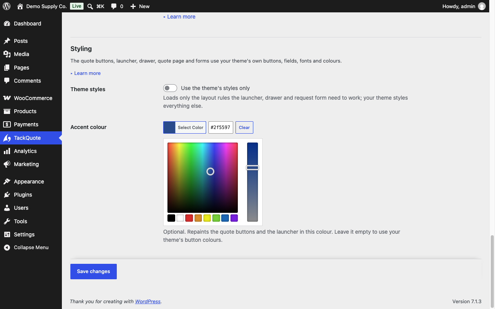</a><br><sub>14. The Styling section of the Storefront tab: use the theme's styles only, or pick an accent colour.</sub></td></tr>
<tr><td width="50%"><a href=".wordpress-org/screenshot-15.png">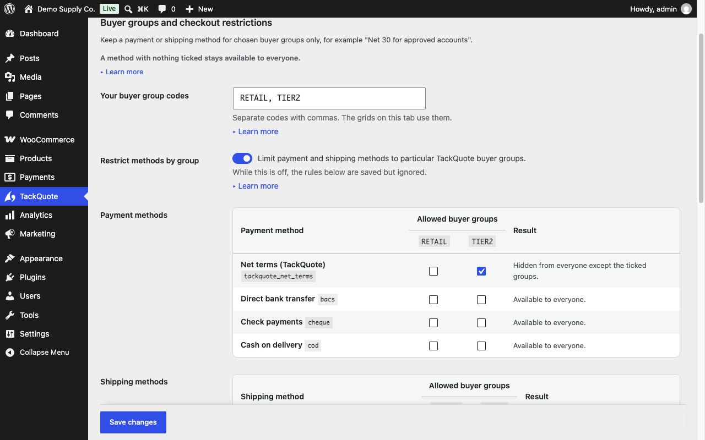</a><br><sub>15. The Buyer groups tab keeps payment and shipping methods for the groups you tick.</sub></td><td width="50%"><a href=".wordpress-org/screenshot-16.png">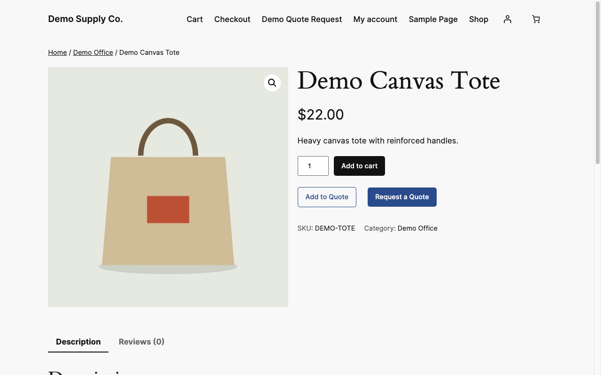</a><br><sub>16. With an accent colour set, the quote buttons blend into Twenty Twenty-Four.</sub></td></tr>
</table>

## Customising the look

The storefront controls take the active theme's buttons, fields, fonts and colours by default. Merchants can set an accent colour or "Use the theme's styles only" under TackQuote > Storefront > Styling, or override `--tackquote-*` CSS variables; developers can override the templates in `templates/tackquote/` from `yourtheme/woocommerce/tackquote/` and use the `tackquote_*` filters. Full reference: [`docs/CUSTOMISATION.md`](docs/CUSTOMISATION.md).

## Installation

1. Download the latest `tackquote.zip` from the [Releases page](https://github.com/tackquote/woocommerce/releases) (direct link: [`tackquote.zip`](https://github.com/tackquote/woocommerce/releases/latest/download/tackquote.zip)), or build locally with `bash bin/build.sh`.
2. In WP Admin go to **Plugins → Add New → Upload Plugin** and upload the ZIP.
3. Activate the plugin.
4. Go to **TackQuote** in the admin menu, open the **Connection** tab and paste your **TackQuote API key** (found in TackQuote under **Settings → Developer → API Keys**). Save, then click **Test TackQuote connection** to verify. The **Overview** tab then shows the connection, storefront, order sync and B2B switches at a glance.

   > **The key must carry the `quotes:write` scope.** *Test connection* uses the unscoped `ping` route, so a key without it passes the test and then fails every real quote submission with a 403. Order sync additionally needs `orders:write`.

## Requirements

- WordPress 6.4+
- WooCommerce 8.0+
- PHP 7.4+

## What it calls

The plugin talks to your TackQuote account over HTTPS using your API key (Bearer + `X-Api-Key`). Configure the API URL in settings (default `https://api.tackquote.com/v1`). Endpoints used:

| Purpose | Method & path |
|---|---|
| Connection test | `GET /integrations/woocommerce/ping` (`/health` only when ping answers 404: reachable, key not verified; 401/403 = key rejected). Also read at most daily from the storefront for the `attachments` capability |
| Quote request from product/cart | `POST /integrations/woocommerce/quote-requests` (target prices as `lineItems[].targetPrice` when the ping lists `attachments`, else in the note) |
| Order sync | `POST /integrations/woocommerce/order-sync` |
| B2B pricing (per buyer, per quantity) | `POST /storefront-pricing/resolve` |
| Product-page price (the page's own product) | `GET /storefront/v1/wholesale-price` |
| Quantity breaks | `GET /storefront/v1/quantity-breaks` (falls back to probing `/storefront-pricing/resolve`) |
| Order limits | `GET /storefront/v1/order-limits` (falls back to `GET /storefront-b2b/order-limits`) |
| Buyer group, tax exemption | `GET /storefront/v1/buyer-group` (falls back to `GET /storefront-b2b/buyer-group`) |
| Wholesale application form | `GET /integrations/woocommerce/wholesale-form?slug=`, `POST /integrations/woocommerce/wholesale-form/submit?slug=` (scope `buyers:write`) |
| Net-terms application | `POST /storefront/v1/credit-application` (falls back to `POST /integrations/woocommerce/credit-application`; scope `buyers:write`) |
| Wholesale price gate (opt-in quote-only scope) | `GET /storefront/v1/price-access` (no fallback; fails closed) |
| Net terms at checkout (opt-in payment method) | `GET /storefront/v1/net-terms` (no fallback; fails closed; re-read when the order is placed) |
| Attachments (only when the server's `ping` lists `attachments`) | `POST /storefront/v1/quote-upload?name=` (quote files; opt-in switch; scope `quotes:write`), `POST /storefront/v1/wholesale-upload?form=&field=&name=` (wholesale files, signed-in only; scope `buyers:write`), raw `application/octet-stream`, `X-Api-Key` only; then `uploadIds` (+ a guest's `uploadToken`) on the quote request, or `POST /storefront/v1/wholesale-signup/<slug>` for an application with files |
| Accepted quote to store checkout (`?tackquote_checkout=` link) | `GET /integrations/woocommerce/quote-checkout/<token>` (once per token, never retried; sends only the token; the order then syncs with `tackQuoteRef`) |

Every request carries `X-TackQuote-Plugin-Version`, and none follows an HTTP redirect (the key is never re-sent elsewhere). `/storefront/v1/*` calls send the key in
`X-Api-Key` only (that route refuses a second credential), with the signed-in customer as
`buyerEmail` + `buyerExternalId` (the WordPress user id; never for a guest). The read-only
lookups need no scope beyond a valid key; the two application forms need `buyers:write`.

### What happens when TackQuote cannot be reached

Every one of the B2B lookups except the opt-in wholesale price gate and the
opt-in net-terms payment method **fails open**, and that is a deliberate design decision rather than an oversight. The
price gate and net terms fail closed because their whole purpose is to keep
something (the cart, an unpaid order) from buyers the seller has not approved:

| Lookup | On failure |
|---|---|
| B2B pricing | the store's own price is used — no product is ever unpriced or zeroed |
| Order limits | **nothing is blocked** — the cart and checkout behave as they always did |
| Buyer group | no badge; restricted methods stay available; hidden categories are shown unless "hide when the group is unknown" is ticked (guest rules still apply, guests need no lookup); no shipping discount; the role mirror changes nothing |
| Wholesale price gate | **fails closed** — the customer sees the quote-only catalogue, and can still request a quote |
| Net terms at checkout | **fails closed** — the "Net terms (TackQuote)" payment method is hidden; every other payment method still works |

The reasoning for order limits is the one worth stating: a checkout that stops
working because a supplier's API is slow costs the day's revenue, while an
unenforced minimum costs a phone call. Failures are written to
**WooCommerce → Status → Logs** (source `tackquote`), so the merchant can see
that B2B pricing is not being applied even though the shop still works.

### Plan gating

The B2B endpoints are gated **server-side** by your TackQuote plan — the plugin
does not check your plan, because a client-side plan check is not a check. On a
plan without B2B pricing the API declines and, by the table above, your store
simply keeps its own prices.

## Development

```bash
# Lint (PHP syntax)
find . -path ./vendor -prune -o -name '*.php' -print0 | xargs -0 -n1 php -l

# Offline regression tests (no WordPress install needed)
php tests/run.php

# Build a distributable zip
bash bin/build.sh   # produces dist/tackquote.zip
```

### Coding standards

The plugin is held to the [WordPress Coding Standards](https://github.com/WordPress/WordPress-Coding-Standards) (`WordPress-Extra` + `WordPress-Docs`), the [WooCommerce sniffs](https://github.com/woocommerce/woocommerce-sniffs) (`WooCommerce-Core`) and `PHPCompatibilityWP` for PHP 7.4+, as configured in [`phpcs.xml.dist`](phpcs.xml.dist). The bar is **zero errors and zero warnings**; CI (`.github/workflows/ci.yml`, job `phpcs`) fails on either.

```bash
composer install      # installs the pinned sniff versions from composer.lock (dev only)
composer lint         # phpcs against phpcs.xml.dist
composer lint:fix     # phpcbf for the auto-fixable part, then run `composer lint` again
```

`composer.json`, `composer.lock`, `phpcs.xml.dist` and `vendor/` are development tooling only: the plugin has no Composer runtime dependency, and `bin/build.sh` both excludes them from `tackquote.zip` and fails the build if any of them is found inside it.

Releases are built and attached by the GitHub Actions workflow `.github/workflows/release.yml` when a `v*` tag is pushed. That workflow calls `scripts/package.sh`, which delegates to `bin/build.sh`, so the two cannot drift. `bin/build.sh` leaves the repository scaffolding (`scripts/`, `.github/`, `LICENSE`, the Composer files and `phpcs.xml.dist`) out of the zip.

While GitHub Actions is unavailable, releases are made by hand from a local build: [`docs/RELEASING.md`](docs/RELEASING.md) covers the GitHub release and the WordPress.org SVN release, which `bin/wporg-sync.sh` stages (trunk, the version tag and the listing assets, from the same zip) without ever committing.

## License

GPL-2.0-or-later
